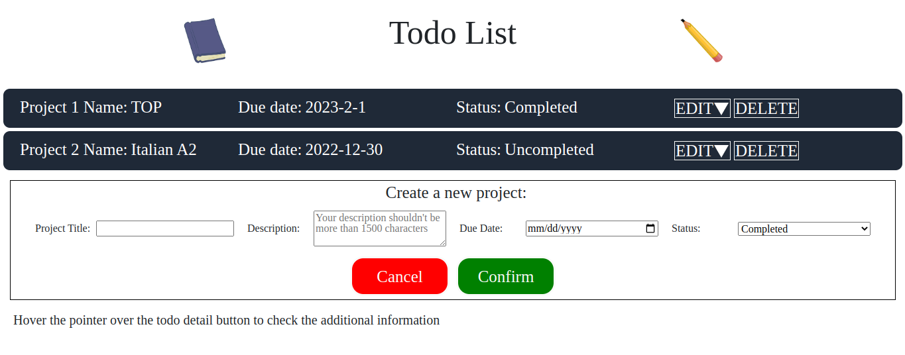
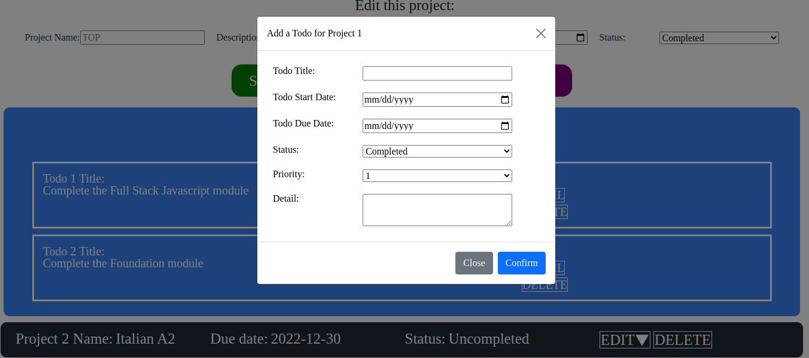

# 11.odin_todo_list

[Task Description](https://www.theodinproject.com/lessons/node-path-javascript-todo-list)

[Live Preview](https://maxim55069633.github.io/11.odin_todo_list/)

In this project, I create a todo list application which can add, view, modify, delete projects and todo item. 

I learn: 
1. Use sessionStorage to store the data within the page. (The information won't be lost when the page is refreshed.)
2. Implement the sort feature by customizing array sort function.
3. Apply different bootstrap components like: modal, accordin, tooltip.
4. Set attributes to the element so that passing arguments to addEventlistener function becomes easier. [This discussion thread helps a lot](https://stackoverflow.com/questions/256754/how-to-pass-arguments-to-addeventlistener-listener-function).
5. Resolve the Error 405 when I delete the form post method.

sample:

I use the following images from bing under the license: free to share and use commercially
1. [pencil](https://cn.bing.com/images/search?view=detailV2&ccid=stsz3I0U&id=68A21AEF95D9C60864163AE7B1C8E91F248A7B64&thid=OIP.stsz3I0UaRt54Q7hElt83gHaHa&mediaurl=https%3A%2F%2Fimg00.deviantart.net%2F5256%2Fi%2F2012%2F122%2F2%2F4%2Fvector___pencil_by_misteraibo-d4y9lvp.png&exph=3000&expw=3000&q=pencil+transparent&simid=608050847152895856&FORM=IRPRST&ck=64B09331EA09F1E2FFC59B0E2C7A4D7F&selectedIndex=0&qft=+filterui%3Alicense-L2_L3_L4&ajaxhist=0&ajaxserp=0)

2. [book](https://cn.bing.com/images/search?view=detailV2&ccid=MN3Lxo54&id=5FA75A7B59FAFFE30CF2EC80606AB39D57E291F2&thid=OIP.MN3Lxo54Kit9clQym1HFvAHaHa&mediaurl=https%3A%2F%2Fimages-wixmp-ed30a86b8c4ca887773594c2.wixmp.com%2Fi%2F1e81ef4a-0b2a-493c-94b5-0209141c3c2f%2Fd4uihg1-99a4ea8c-5f7f-4ab6-9bd2-fbd4dbd96f74.png&exph=3333&expw=3333&q=book+transparent&simid=608035020202999560&FORM=IRPRST&ck=1CCA3EDF6F2186C0A7379F0526E361EC&selectedIndex=1&qft=+filterui%3Alicense-L2_L3_L4&ajaxhist=0&ajaxserp=0)

